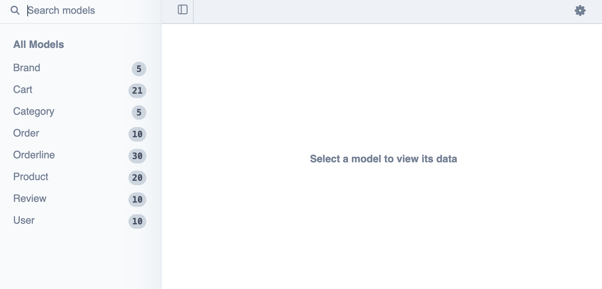

# Sgt. Prepper Webshop

Et starterprojekt med **Node.js**, **TypeScript**, **Express 5**, og **Prisma ORM**. Perfekt som udgangspunkt for REST API'er med moderne værktøjer og datamodellering.

---

## 🛠 Teknologier

- [TypeScript](https://www.typescriptlang.org/)
- [Express 5](https://expressjs.com/)
- [Prisma ORM](https://www.prisma.io/)
- [TSX](https://github.com/esbuild-kit/tsx)
- [dotenv](https://www.npmjs.com/package/dotenv)
- [bcrypt](https://www.npmjs.com/package/bcrypt)

---

## Kom i gang

### 1. Klon repo og installér afhængigheder

```bash
git clone https://github.com/Webudvikler-TechCollege/sgtprepper-api-ts-prisma
cd sgtprepper-api-ts-prisma
npm install
```
### 2. Kopier eller omdøb *.env.example* til *.env*

```bash
cp .env.example .env
```
### 3. Start serveren
```bash
npm run dev
```
### 4. Få overblik over data
```bash
npx prisma studio
```
Nu skulle du gerne kunne se en oversigt over dine modeller og data i din browser:

Eksempel:
